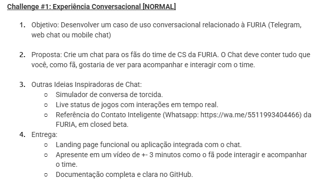

#Interface Conversacional

##INTRODUÇÃO
Olá! Esse projeto foi feito como parte do processo seletivo para vaga de Assistente de Software na FURIA que estou participando. A ideia aqui era criar um chat bot com interações para os fãs de CS da FURIA. Como meu conhecimento em APIs e Bots é bem escasso ainda, decidi fazer um protótipo funcional com HTML, CSS, JavaScript e informações simuladas. Para documentar todo meu processo, vou deixar primeiramente as condições do desafio:

##DESAFIO

##PESQUISA
Primeiro, fiz uma pesquisa, com ajuda do ChatGPT, sobre a empresa em si, o time, sua história e o perfil dos fãs. Então, depois de entender um pouco mais parti para o fluxograma do "bot", pois acredito que com ele consegui me guiar bem mais facilmente na parte de programação. Por ser voltado ao CS, tive que pesquisar também bastante sobre os campeonatos e como as partidas funcionam. Usei o site da própria FURIA como base, sites de notícia e outras, assim como o ChatGPT que também me trouxe diversas informações.

##FLUXOGRAMA
Utilizei o Figma para fazer este fluxograma, apesar de não saber muito sobre a ferramenta já tinha utilizado ela para outros projetos então foi muito "intuitivo" todo o processo. Pesquisei também sobre os símbolos do fluxograma e como estava fazendo apenas um protótipo optei por utilizar apenas os básicos, mas para facilitar o entendimento, deixei uma legenda no .fig e no pdf do significado de cada elemento.

##CÓDIGO
Utilizei o VsCode para codar por ter maior familiaridade com a ferramenta. Primeiro fiz configurações básicas da estrtura do HTML, depois parti para o JavaScript, por ser a parte mais complexa do código e a parte que eu menos tenho conhecimento. Eu mostrei meu fluxograma ao ChatGPT e pedi ajuda no JS, então fui desenvolvendo com base no que ele me mostrava mas também testava muito cada hipótese e cada coisa que quis mudar. Nele tem duas funções básicas pra todas as interações que são as de adicionar mensagem do bot e de adicionar mensagem do usuário, onde básicamente cada uma delas simula as mensagens. Tem também algumas funções específicas que fazem as mensagens que envolvem placares, imagens dos jogadores e links. No CSS, desenvolvi um design simples baseado nas imagens que tem no código como o background, com algumas animações não muito trabalhadas apenas para fim de simulação, já que se trata de um protótipo.  

##DESIGN/IMAGENS
As logos da FURIA eu peguei no Google e removi o fundo, já o fundo do chat eu peguei um wallpaper oficial da FURIA no X, a fonte utilizei uma gratuita chamada Victor Mono que consegui pelo Google Fonts, o design das respostas segui o mesmo conceito da estética dos sites oficiais.

##PS:
Todos os documentos, códigos e imagens estão disponíveis nas pastas com seus respectivos nomes.